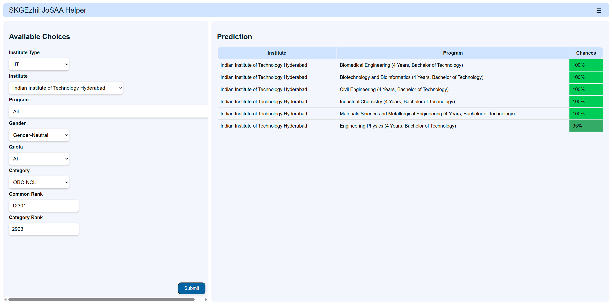

# SKGEzhil JoSAA Helper

This tool provides a straightforward way to determine the availability of seats based on your JEE Mains or JEE Advanced Rank. The data used for this tool is derived from the JEE Advanced 2022, ensuring the information is accurate and up-to-date. With this tool, you can easily find out the number of seats that are currently available for your specific rank in the JEE Advanced exam. It simplifies the process of exploring your options and making informed decisions regarding college admissions.

Developer: SKGEzhil \
Email: skgezhil2005@gmail.com \
Instagram: @skgezhil2005 \
Youtube: https://youtube.com/skgezhil/